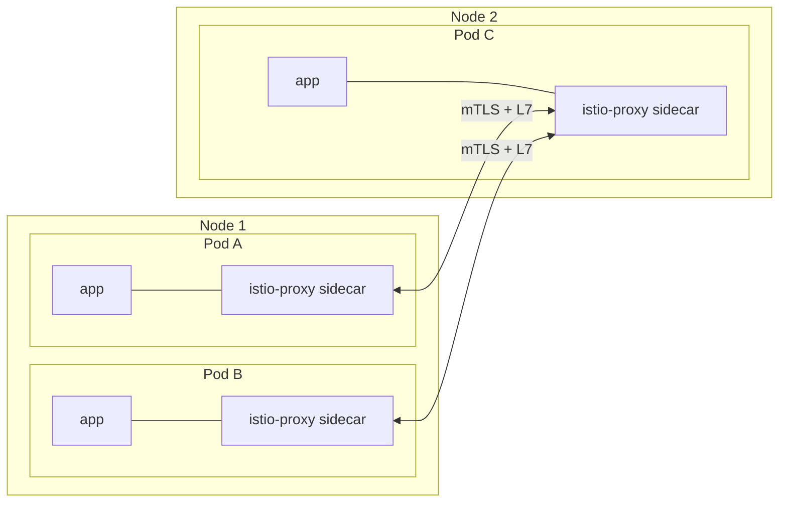
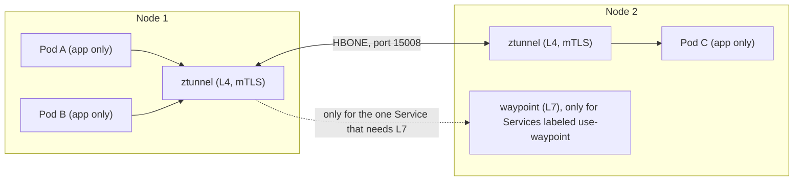

# Architecture: sidecar mode vs ambient mode

## Sidecar mode (one proxy per pod)

Every pod carries its own Envoy. Proxy count = number of pods. Every proxy pays for full L7 processing whether the app needs it or not.

## Ambient mode (shared per-node L4 proxy, optional L7 proxy)

ztunnel runs once per node (DaemonSet) and does mTLS plus L4 policy for every pod on that node. A waypoint (an Envoy Deployment) exists only where L7 features are needed. In this lab that is the `reviews` Service only.

## Comparison

| | Sidecar | Ambient |
|---|---|---|
| Where the proxy lives | inside every pod (native sidecar in `initContainers`) | ztunnel: one per node. waypoint: optional, per namespace/Service |
| L4 mTLS | sidecar | ztunnel (HBONE on port 15008) |
| L7 features | always on, in every sidecar | only where a waypoint is attached |
| Joining the mesh | pods must be recreated to get the sidecar | namespace label only, no pod restart (verified in this lab) |
| Proxy image / version | baked into every app pod | lives in the ztunnel DaemonSet, app pods untouched by a ztunnel restart (verified) |
| Proxy count scales with | number of pods | number of nodes (+ waypoints) |
| L7 policy enforcement point | the sidecar | the waypoint only. Traffic sent straight to a pod IP skips it (verified) |
